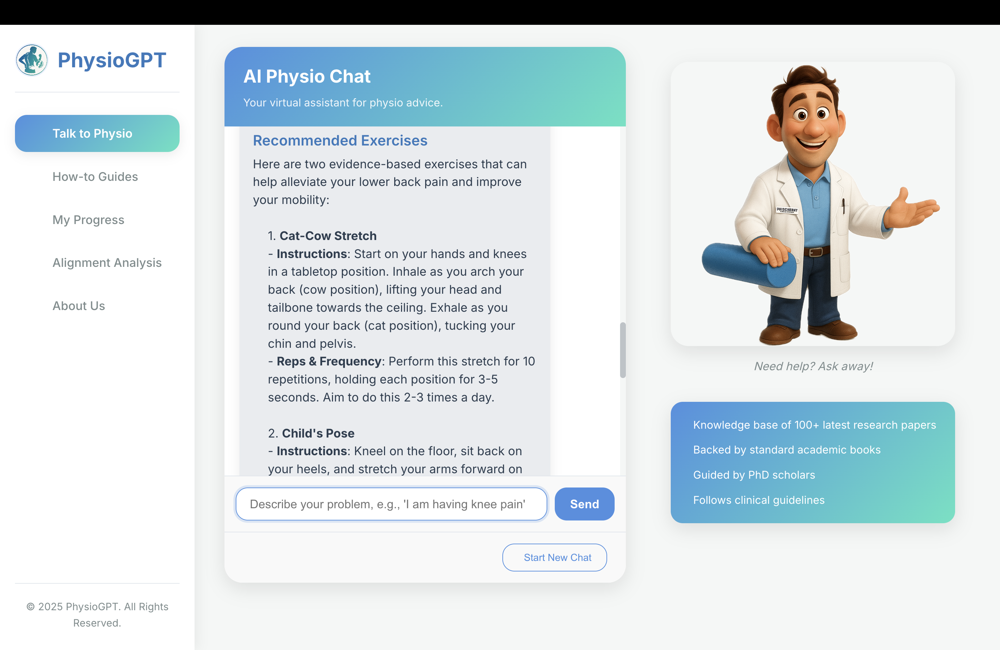
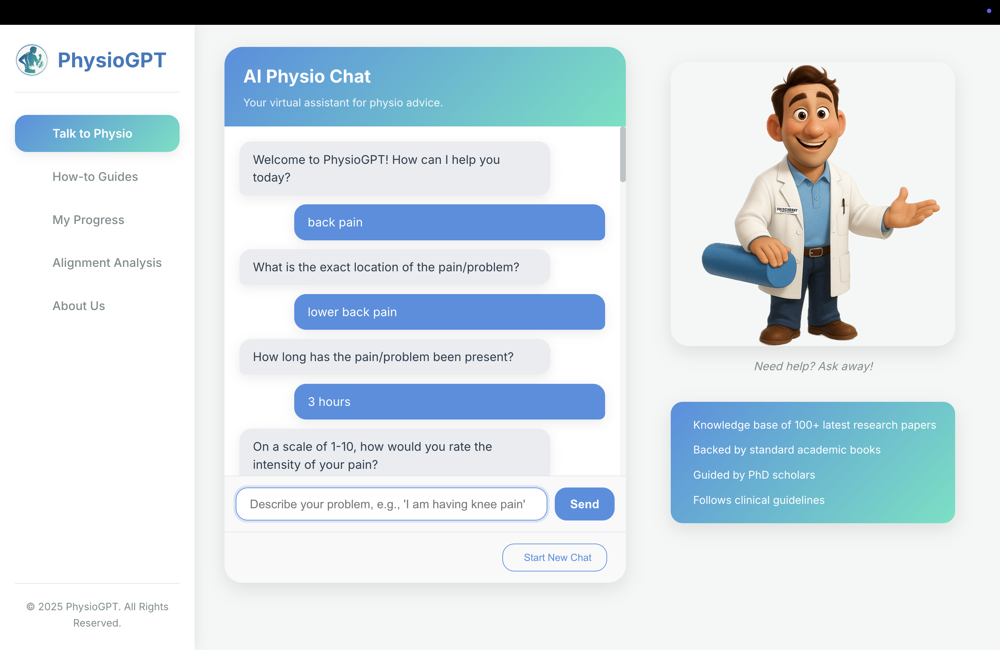

# PhysioGPT – AI Physiotherapy Chatbot 🤖💪

PhysioGPT is an AI-powered chatbot that provides early guidance for common musculoskeletal problems like back pain, knee pain, and neck stiffness. Built using Retrieval-Augmented Generation (RAG) architecture with LangChain and GPT-4o, it delivers contextual, research-backed exercise advice and symptom analysis based on user responses.

---

## 🧠 Features

- 🔍 SOP-based symptom assessment (structured questions)
- 📚 Uses a curated knowledge base of 100+ research papers, books, and clinical guidelines
- 🧘‍♂️ Personalized exercise recommendations
- 📸 Visual "How-To" exercise gallery
- 📄 Downloadable PDF summaries (planned)
- 📈 Track recovery progress (planned)
- 🎙️ Voice and multilingual support (future roadmap)

---

## 🛠️ Tech Stack

- **Frontend**: HTML, CSS, JavaScript
- **Backend**: Python, FastAPI
- **AI Stack**: OpenAI GPT, LangChain, FAISS (for vector search)
- **Data**: Physiotherapy textbooks, research papers (2023–2025), SOP protocols
